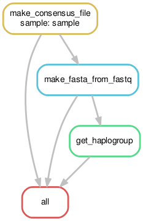

# El genoma pequeño - analysis workflow for "the little genome"
### Note: the character ``` ñ ``` is not supported in Github repository names at this time

The mitochondrial workflows in this github have a few purposes. First is to get a high quality mitochondrial genome out of an Illumina sequencing bam or cram file (this workflow assumes this bam/cram was initially mapped to a reference using BWA MEM). Second is to get a representative fasta for the mitochondrial genome and to use Mitomaster to determine its haplogroup. Third is to collect variants from the mitochondria including those which meet some minimum threshold for being a heteroplasmic variant. Finally, it generates a world map with your sample(s) mapped to the location where their haplogroup is thought to have been derived in the world. To generate coordinates, I approximated based on looking at the following map: https://www.mitomap.org/foswiki/pub/MITOMAP/MitomapFigures/WorldMigrations2012.pdf. 

We highly suggest some other analyses for family-based studies such as taking all of the fastas and generating a multi-sequence alignment and tree (they are not currently implemented in this github). The workflows in this github run in ~ 2 minutes per sample.

Requirements:
```

samtools
python
pysam
pysamstats
R
bcftools
picard
R package: seqinr
R package: optparse
Python package: biopython

```

Users will want to set up the config.json to point to the required information

```

reference: path to the reference that was used for generating the BAM/CRAM
data_dir: path to the BAM/CRAM file
file_tail: end of BAM/CRAM file name (for example if your file is named sample1.final.cram this would be .final.cram)
picard: path to the picard-tools-2.5.0/picard.jar
java: path to the jre1.8.0_65/bin/java
mitoname: The name of the mito as in the file (chrM or MT)
mitobam_dir: this is fixed (do not change)
mito_ref: path to the mitochondrial reference genome the human MT and chrM are located in the github at reference/chrM.fasta

```

To run the analysis locally

```

sh run_analysis.sh

```

To submit to cluster

```

sh cluster_analysis.sh

```

Output files:

```
haplogroup/sample.fasta.for.mega : One fasta file for each sample (can be loaded into MEGA for tree building)
haplogroup/sample.haplogroup.txt : One MitoMaster result file for each sample
haplogroup/summary_haplogroup.txt : Summary file of all haplogroups
mitobam/sample.MT.clean.name.bam : One bam file for each sample
mitobam/sample.MT.clean.name.bam.bai : One bai file for each sample
variants/sample.pysamstats.heteroplasmy.txt : One heteroplasmy site file per person
variants/sample.pysamstats.variants.txt : One variant site file per person
map/haplogroup_map.pdf : A world map with all of the samples 

```

**Note:** if no haplogroup is identified using mitomaster in the haplogroup workflow, the haplogroup is the same as the rCRS reference sequence (H2a2a1). This is from personal communication with the mitomap help email.


### Example setup on a RedHat Linux (may need to ask an system administrator for help if running on your server or alternatively you can set this up in the cloud on a RedHat instance)

```
#update machine
sudo yum -y update

#install basics
sudo yum -y install gcc
sudo yum -y install zlib-devel
sudo yum -y install bzip2-devel
sudo yum -y install xz-devel
sudo yum -y install gcc-c++
sudo yum -y install wget
sudo yum -y install bzip2

#get anaconda and install
wget https://repo.continuum.io/archive/Anaconda2-5.0.1-Linux-x86_64.sh
sh Anaconda2-5.0.1-Linux-x86_64.sh
source ~/.bashrc

#install required for the softwre
conda install -c bioconda samtools
conda install -c bioconda R
conda install -c bioconda pysam
conda install -c bioconda pysamstats
conda install -c bioconda hdf5
conda install -c bioconda bcftools
conda install -c bioconda picard
conda install -c bioconda biopython

conda create -n py35 python=3.5 anaconda
source activate py35
conda install -c bioconda snakemake

#inside of R install the following
install.packages('seqinr')
install.packages('optparse')
install.packages('maps')

#install git
sudo yum -y install git

#testing
git clone https://github.com/tycheleturner/ElGenomaPequeno.git
source activate py35
conda install -c bioconda biopython
conda install pip

source deactivate py35
pip install poster
source activate py35
```

### Example analysis with data from 1000 Genomes

```
#get the data (low pass WGS)
wget ftp://ftp-trace.ncbi.nih.gov/1000genomes/ftp/phase3/data/NA19238/alignment/NA19238.mapped.ILLUMINA.bwa.YRI.low_coverage.20130415.bam.cram

wget ftp://ftp-trace.ncbi.nih.gov/1000genomes/ftp/phase3/data/NA19240/alignment/NA19240.mapped.ILLUMINA.bwa.YRI.low_coverage.20130415.bam.cram

wget ftp://ftp-trace.ncbi.nih.gov/1000genomes/ftp/phase3/data/NA19239/alignment/NA19239.mapped.ILLUMINA.bwa.YRI.low_coverage.20130415.bam.cram

#index crams
for file in *cram
do
samtools index "$file"
done

#get reference files
wget http://ftp.1000genomes.ebi.ac.uk/vol1/ftp/technical/reference/human_g1k_v37.fasta.gz
gunzip human_g1k_v37.fasta.gz
wget http://ftp.1000genomes.ebi.ac.uk/vol1/ftp/technical/reference/human_g1k_v37.fasta.fai

cd ElGenomaPequeno

#update config.json as follows (if running in the cloud):
{
  "reference": "/home/ec2-user/human_g1k_v37.fasta",
  "data_dir": "/home/ec2-user/",
  "file_tail": ".mapped.ILLUMINA.bwa.YRI.low_coverage.20130415.bam.cram",
  "picard": "picard",
  "java": "java",
  "mitoname": "MT",
  "mitobam_dir": "../mitobam/",
  "mito_ref": "../reference/MT.fasta",
  "heteroplasmy_threshold": "15"
}

sh run_analysis.sh

```

### Workflows inside of this github

#### Mitobam 


#### Haplogroup 


#### Variants


### Example haplogroup map (from 1000 Genomes dataset)


### Mitochondrial Genome Copy Number from Short-Read WGS
A standalone snake has been added for calcuating copy number from the mitochondrial genome.


